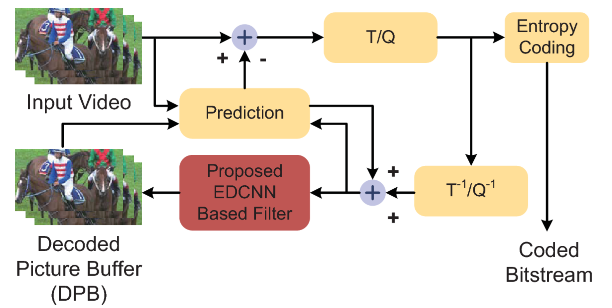
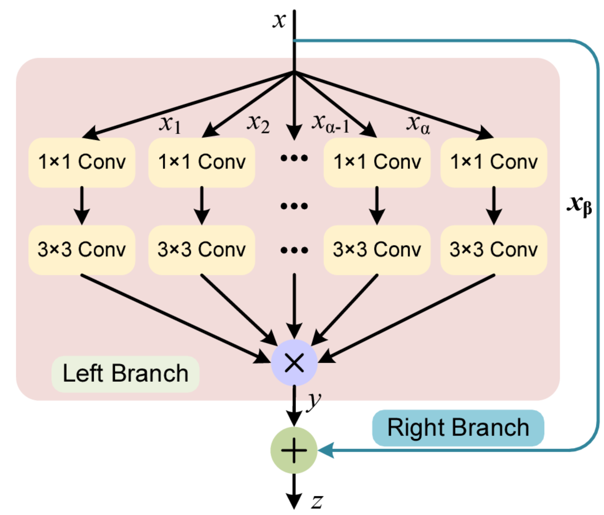
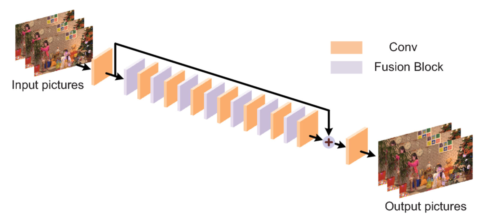
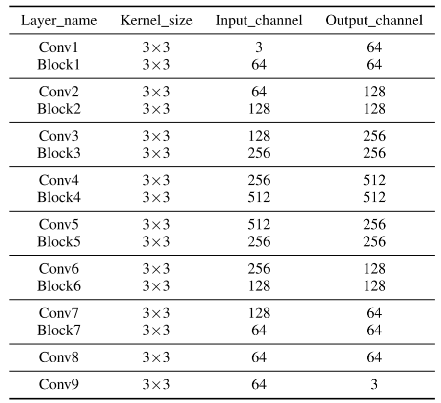
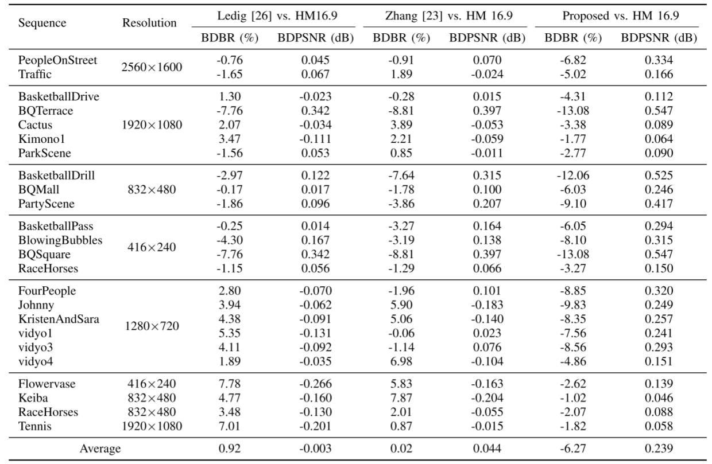
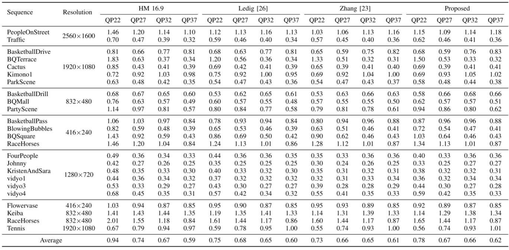
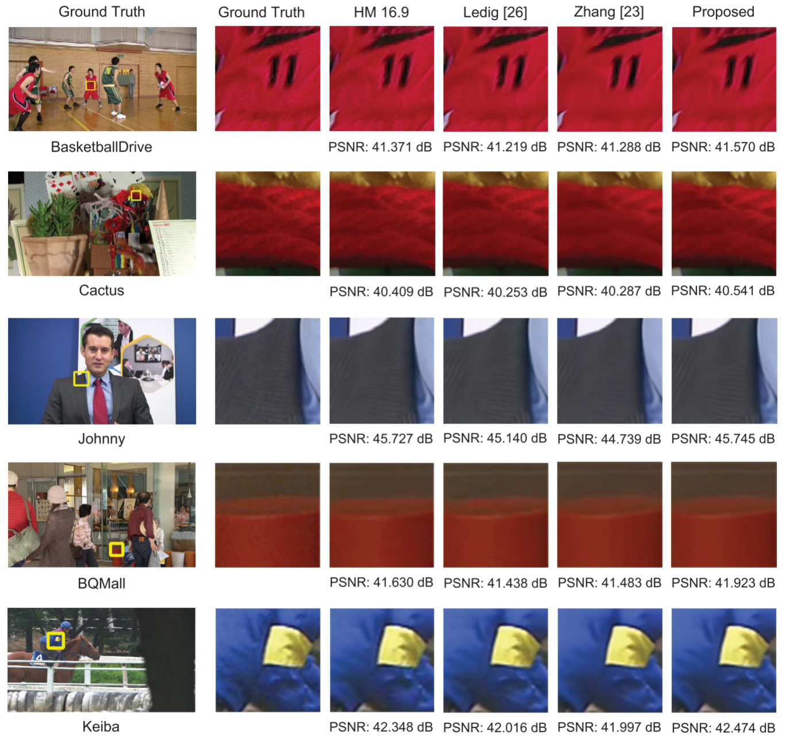

## [Efficient In-loop Filtering Based on Enhanced Deep Convolutional Neural Networks for HEVC](https://ieeexplore.ieee.org/stamp/stamp.jsp?tp=&arnumber=9049421)

### The in-loop filtering in HEVC



We propose an efficient in-loop filtering algorithm based on the enhanced deep convolutional neural networks (EDCNN) for significantly improving the performance of in-loop filtering in HEVC.  the EDCNN is proposed for efficiently eliminating the artifacts, which adopts three solutions, including **a weighted normalization method**, **a feature information fusion block**, and **a precise loss function**. 

------

### Our proposed EDCNN

#### 1. The structure of proposed feature information fusion block 



#### 2. The architecture of proposed EDCNN 



#### 3. The detailed network parameters



------

### Experimental Results

#### 1. The PSNR standard deviations of Low-Delay coding structure



#### 2. The PSNR standard deviations of Random-Access coding structure



#### 3. Video subjective quality comparison



### Test instruction using pretrained model

```python
python3 predict.py --model [pretrained model] --dir_demo [demo images directory] --save_name [directory to save] --pre_train [weightfile]
```

#### Arguments
- n_threads: number of threads for data loading
- cpu: use cpu only
- dir_demo: demo image directory
- model: model name
- pre_train: pretrained model directory
- save_name: directory to save

### Citation

Z. Pan, X. Yi, Y. Zhang, B. Jeon and S. Kwong, "Efficient In-Loop Filtering Based on Enhanced Deep Convolutional Neural Networks for HEVC," in *IEEE Transactions on Image Processing*, vol. 29, pp. 5352-5366, 2020